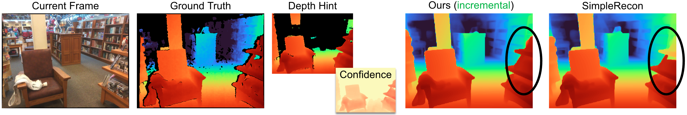
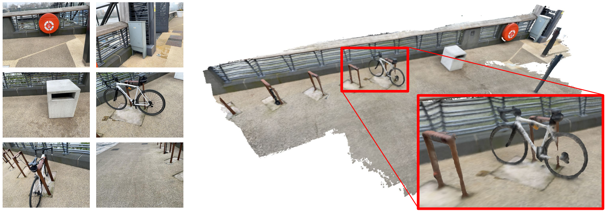

# DoubleTake: Geometry Guided Depth Estimation

This is the reference PyTorch implementation for training and testing MVS depth estimation models using the method described in

> **DoubleTake: Geometry Guided Depth Estimation**
>
> [Mohamed Sayed](https://masayed.com), [Filippo Aleotti](https://filippoaleotti.github.io/website/), [Jamie Watson](https://www.linkedin.com/in/jamie-watson-544825127/), [Zawar Qureshi](https://qureshizawar.github.io/), [Guillermo Garcia-Hernando](), [Gabriel Brostow](http://www0.cs.ucl.ac.uk/staff/g.brostow/), [Sara Vicente](https://scholar.google.co.uk/citations?user=7wWsNNcAAAAJ&hl=en) and  [Michael Firman](http://www.michaelfirman.co.uk).
>
> [Paper, ECCV 2024 (arXiv pdf)](https://nianticlabs.github.io/doubletake/resources/DoubleTake.pdf), [Supplemental Material](https://nianticlabs.github.io/doubletake/resources/DoubleTakeSupplemental.pdf), [Project Page](https://nianticlabs.github.io/doubletake/), [Video](https://www.youtube.com/watch?v=IklQ5AHNdI8&feature=youtu.be)

<p align="center">
  
</p>


<p align="center">
  
</p>

Please, refer to the the [license file](LICENSE) for terms of usage. If you use this codebase in your research, please consider citing our paper using the BibTex below and link this repo. Thanks!

## Table of Contents

  * [🗺️ Overview](#%EF%B8%8F-overview)
  * [⚙️ Setup](#%EF%B8%8F-setup)
  * [📦 Trained Models and Precomputed Meshes/Scores](#-pretrained-models)
  * [🚀 Speed](#-speed)
  * [🏃 Running out of the box!](#-running-out-of-the-box)
  * [💾 ScanNetv2 Dataset](#-scannetv2-dataset)
  * [💾 SimpleRecon ScanNet Training Depth Renders](#-simplerecon-scannet-training-depth-renders)
  * [💾 3RScan Dataset](#-3rscan-dataset)
  * [📊 Testing and Evaluation](#-testing-and-evaluation)
  * [📊 Mesh Metrics](#-mesh-metrics)
  * [📝🧮👩‍💻 Notation for Transformation Matrices](#-notation-for-transformation-matrices)
  * [🗺️ World Coordinate System](#%EF%B8%8F-world-coordinate-system)
  * [🔨💾 Training Data Preperation](#-training-data-preperation)
  * [🙏 Acknowledgements](#-acknowledgements)
  * [📜 BibTeX](#-bibtex)
  * [👩‍⚖️ License](#%EF%B8%8F-license)

## 🗺️ Overview

DoubleTake takes as input posed RGB images, and outputs a depth map for a target image.

## ⚙️ Setup

We are going to create a new Mamba environment called `doubletake`. If you don't have Mamba, you can install it with:

```shell
make install-mamba
```

Then setup the environment with:
```shell
make create-mamba-env
mamba activate doubletake
```

In the code directory, install the repo as a pip package:
```shell
pip install -e .
```

Some C++ code will compile JIT using ninja the first time you use any of the fusers. Should be quick.

## 📦 Trained Models and Precomputed Meshes/Scores
We provide three models. The standard DoubleTake model used for incremental, offline, and revisit evaluation on all datasets and figures in the paper, a slimmed down faster version of DoubleTake, and the vanilla SimpleRecon model we used for SimpleRecon scores. Use the links in the table to access the weights for each. The scores here are very slightly different (better) than those in the paper due to a slight bug fix in training data renders.

Download a pretrained model into the `weights/` folder.

Scores on ScanNet:
| Model         | Config                                | Weights                                                               | Notes         |
|---------------|---------------------------------------|-----------------------------------------------------------------------|---------------|
| SimpleRecon   | configs/models/simplerecon_model.yaml | [Link](https://storage.googleapis.com/niantic-lon-static/research/doubletake/simplerecon_model.ckpt)   |               |
| DoubleTake Small | configs/models/doubletake_small_model.yaml | [Link](https://storage.googleapis.com/niantic-lon-static/research/doubletake/doubletake_small_model.ckpt) |               |
| DoubleTake    | configs/models/doubletake_model.yaml  | [Link](https://storage.googleapis.com/niantic-lon-static/research/doubletake/doubletake_model.ckpt)      | ours in the paper |

| Offline/Two Pass using `test_offline_two_pass` | Abs Diff↓ | Sq Rel↓ | delta < 1.05↑ | Chamfer↓ | F-Score↑ | Meshes and Full Scores |
|-------------------------------------------------|-----------|---------|---------------|----------|----------|-------------------------|
| SimpleRecon (Offline Tuples w/ `test_no_hint` ) | .0873     | .0128   | 74.12         | 5.29     | .668     | [Link](https://storage.googleapis.com/niantic-lon-static/research/doubletake/simplerecon_offline.tar) |
| DoubleTake Small                                | .0631     | .0097   | 86.36         | 4.64     | .723     | [Link](https://storage.googleapis.com/niantic-lon-static/research/doubletake/doubletake_small_offline.tar) |
| DoubleTake                                      | .0624     | .0092   | 86.64         | 4.42     | .742     | [Link](https://storage.googleapis.com/niantic-lon-static/research/doubletake/doubletake_offline.tar) |

| Incremental using `test_incremental` | Abs Diff↓ | Sq Rel↓ | delta < 1.05↑ | Chamfer↓ | F-Score↑ | Meshes and Full Scores |
|----------------------------------------|-----------|---------|---------------|----------|----------|-------------------------|
| DoubleTake Small                        | .0825     | .0124   | 76.75         | 5.53     | .649     |[Link](https://storage.googleapis.com/niantic-lon-static/research/doubletake/doubletake_small_incremental.tar) |
| DoubleTake                              | .0754     | .0109   | 80.29         | 5.03     | .689     |[Link](https://storage.googleapis.com/niantic-lon-static/research/doubletake/doubletake_incremental.tar) |

| No hint and online using `test_no_hint` | Abs Diff↓ | Sq Rel↓ | delta < 1.05↑ | Chamfer↓ | F-Score↑ | Meshes and Full Scores |
|----------------------------------------|-----------|---------|---------------|----------|----------|-------------------------|
| SimpleRecon (Online Tuples)            | .0873     | .0128   | 74.12         | 5.29     | .668     | [Link](https://storage.googleapis.com/niantic-lon-static/research/doubletake/simplerecon_online.tar) | 
| DoubleTake Small                       | .0938     | .0148   | 72.02         | 5.50     | .650     | [Link](https://storage.googleapis.com/niantic-lon-static/research/doubletake/doubletake_small_no_hint.tar) |
| DoubleTake                             | .0863     | .0127   | 74.64         | 5.22     | .672     | [Link](https://storage.googleapis.com/niantic-lon-static/research/doubletake/doubletake_no_hint.tar) |


## 🚀 Speed
Please see the paper and supplemental material for details on runtime. We do not include the first-pass feature caching step in this code release.


## 🏃 Running out of the box!

We've included two scans for people to try out immediately with the code. You can download these scans [from here](https://drive.google.com/file/d/1x-auV7vGCMdu5yZUMPcoP83p77QOuasT/view?usp=sharing).

Steps:
1. Download weights for the `hero_model` into the weights directory.
2. Download the scans and unzip them into `datasets/`
3. If you've unzipped into a different folder, modify the value for the option `dataset_path` in `configs/data/vdr/vdr_default_offline.yaml` to the base path of the unzipped vdr folder.
4. You should be able to run it! Something like this will work:

For offline depth estimation and fusion:
```bash
CUDA_VISIBLE_DEVICES=0 python -m doubletake.test_offline_two_pass --name doubletake_offline \
            --output_base_path $OUTPUT_PATH \
            --config_file configs/models/doubletake_model.yaml \
            --load_weights_from_checkpoint weights/doubletake_model.ckpt \
            --data_config configs/data/vdr/vdr_default_offline.yaml \
            --num_workers 8 \
            --batch_size 2 \
            --fast_cost_volume \
            --run_fusion \
            --depth_fuser custom_open3d \
            --fuse_color \
            --fusion_max_depth 3.5 \
            --fusion_resolution 0.02 \
            --trim_tsdf_using_confience \
            --extended_neg_truncation \
            --dump_depth_visualization;
```

This will output meshes, quick depth viz, and scores when benchmarked against LiDAR depth under `OUTPUT_PATH`. 

This command uses `vdr_default_offline.yaml` which will generate a depth map for every keyframe and fuse them into a mesh. You can also use `dense_offline` tuples by instead using `vdr_dense_offline.yaml` for a depth map for every frame.


See the section below on testing and evaluation. Make sure to use the correct config flags for datasets. 

## 💾 ScanNetv2 Dataset
We've written a quick tutorial and included modified scripts to help you with downloading and extracting ScanNetv2. You can find them at [data_scripts/scannet_wrangling_scripts/](data_scripts/scannet_wrangling_scripts)

You should change the `dataset_path` config argument for ScanNetv2 data configs at `configs/data/` to match where your dataset is.

The codebase expects ScanNetv2 to be in the following format:

    dataset_path
        scans_test (test scans)
            scene0707
                scene0707_00_vh_clean_2.ply (gt mesh)
                sensor_data
                    frame-000261.pose.txt
                    frame-000261.color.jpg 
                    frame-000261.color.512.png (optional, image at 512x384)
                    frame-000261.color.640.png (optional, image at 640x480)
                    frame-000261.depth.png (full res depth, stored scale *1000)
                    frame-000261.depth.256.png (optional, depth at 256x192 also
                                                scaled)
                scene0707.txt (scan metadata and image sizes)
                intrinsic
                    intrinsic_depth.txt
                    intrinsic_color.txt
            ...
        scans (val and train scans)
            scene0000_00
                (see above)
            scene0000_01
            ....

In this example `scene0707.txt` should contain the scan's metadata:

        colorHeight = 968
        colorToDepthExtrinsics = 0.999263 -0.010031 0.037048 ........
        colorWidth = 1296
        depthHeight = 480
        depthWidth = 640
        fx_color = 1170.187988
        fx_depth = 570.924255
        fy_color = 1170.187988
        fy_depth = 570.924316
        mx_color = 647.750000
        mx_depth = 319.500000
        my_color = 483.750000
        my_depth = 239.500000
        numColorFrames = 784
        numDepthFrames = 784
        numIMUmeasurements = 1632

`frame-000261.pose.txt` should contain pose in the form:

        -0.384739 0.271466 -0.882203 4.98152
        0.921157 0.0521417 -0.385682 1.46821
        -0.0587002 -0.961035 -0.270124 1.51837

`frame-000261.color.512.png` and `frame-000261.color.640.png` are precached resized versions of the original image to save load and compute time during training and testing. `frame-000261.depth.256.png` is also a 
precached resized version of the depth map. 

All resized precached versions of depth and images are nice to have but not 
required. If they don't exist, the full resolution versions will be loaded, and downsampled on the fly.


## 💾 SimpleRecon ScanNet Training Depth Renders
DoubleTake is trained using depth and confidence renders of partial and full meshes of the train and validation ScanNet splits. We've provided these [here](https://storage.googleapis.com/niantic-lon-static/research/doubletake/renders.tar) if you'd like to train a DoubleTake model.

## 💾 3RScan Dataset

This section explains how to prepare 3RScan for testing:

Please download and extract the dataset by following the instructions [here](https://github.com/WaldJohannaU/3RScan).

The dataset should be formatted like so:

```
<dataset_path>
  <scanId>
  |-- mesh.refined.v2.obj
      Reconstructed mesh
  |-- mesh.refined.mtl
      Corresponding material file
  |-- mesh.refined_0.png
      Corresponding mesh texture
  |-- sequence.zip
      Calibrated RGB-D sensor stream with color and depth frames, camera poses
  |-- labels.instances.annotated.v2.ply
      Visualization of semantic segmentation
  |-- mesh.refined.0.010000.segs.v2.json
      Over-segmentation of annotation mesh
  |-- semseg.v2.json
            Instance segmentation of the mesh (contains the labels)
```

Please make sure to extract each `sequence.zip` inside every `scanId` folder.

We provide the frame tuple files for this dataset (see for eg. `data_splits/3rscan/test_eight_view_deepvmvs.txt`) but if you need recreate them, you can do so by following the instructions [here](https://github.com/nianticlabs/simplerecon/tree/main?tab=readme-ov-file#%EF%B8%8F%EF%B8%8F%EF%B8%8F-frame-tuples).

NOTE: we only use 3RScan dataset for testing and the data split used (`data_splits/3rscan/3rscan_test.txt`) corresponds to the validation split in the original dataset repo (`splits/val.txt`). We use the val split as the transformations that align the reference scan to the rescans are readily available for the train and val splits. 


## 🖼️🖼️🖼️ Frame Tuples

By default, we estimate a depth map for each keyframe in a scan. We use DeepVideoMVS's heuristic for keyframe separation and construct tuples to match. We use the depth maps at these keyframes for depth fusion. For each keyframe, we associate a list of source frames that will be used to build the cost volume. We also use dense tuples, where we predict a depth map for each frame in the data, and not just at specific keyframes; these are mostly used for visualization.

We generate and export a list of tuples across all scans that act as the dataset's elements. We've precomputed these lists and they are available at `data_splits` under each dataset's split. For ScanNet's test scans they are at `data_splits/ScanNetv2/standard_split`. Our core depth numbers are computed using `data_splits/ScanNetv2/standard_split/test_eight_view_deepvmvs.txt`.


Here's a quick taxonamy of the type of tuples for test:

- `default`: a tuple for every keyframe following DeepVideoMVS where all source frames are in the past. Used for all depth and mesh evaluation unless stated otherwise. For ScanNet use `data_splits/ScanNetv2/standard_split/test_eight_view_deepvmvs.txt`.
- `offline`: a tuple for every frame in the scan where source frames can be both in the past and future relative to the current frame. These are useful when a scene is captured offline, and you want the best accuracy possible. With online tuples, the cost volume will contain empty regions as the camera moves away and all source frames lag behind; however with offline tuples, the cost volume is full on both ends, leading to a better scale (and metric) estimate.
- `dense`: an online tuple (like default) for every frame in the scan where all source frames are in the past. For ScanNet this would be `data_splits/ScanNetv2/standard_split/test_eight_view_deepvmvs_dense.txt`.
- `dense_offline`: an offline tuple for every frame in the scan.

For the train and validation sets, we follow the same tuple augmentation strategy as in DeepVideoMVS and use the same core generation script.

If you'd like to generate these tuples yourself, you can use the scripts at `data_scripts/generate_train_tuples.py` for train tuples and `data_scripts/generate_test_tuples.py` for test tuples. These follow the same config format as `test.py` and will use whatever dataset class you build to read pose informaiton.

Example for test:

```bash
# default tuples
python ./data_scripts/generate_test_tuples.py 
    --data_config configs/data/scannet/scannet_default_test.yaml
    --num_workers 16

# dense tuples
python ./data_scripts/generate_test_tuples.py 
    --data_config configs/data/scannet_dense_test.yaml
    --num_workers 16
```

Examples for train:

```bash
# train
python ./data_scripts/generate_train_tuples.py 
    --data_config configs/data/scannet/scannet_default_train.yaml
    --num_workers 16

# val
python ./data_scripts/generate_val_tuples.py 
    --data_config configs/data/scannet/scannet_default_val.yaml
    --num_workers 16
```

These scripts will first check each frame in the dataset to make sure it has an existing RGB frame, an existing depth frame (if appropriate for the dataset), and also an existing and valid pose file. It will save these `valid_frames` in a text file in each scan's folder, but if the directory is read only, it will ignore saving a `valid_frames` file and generate tuples anyway.


## 📊 Testing and Evaluation

### Depth Evaluation

You can evaluate our model on the depth benchmark of ScanNetv2 using the following commands:

For online incremental depth estimation, use this command.
```shell
CUDA_VISIBLE_DEVICES=0 python -m doubletake.test_incremental \
    --name doubletake_incremental \
    --config_file configs/models/doubletake_model.yaml \
    --load_weights_from_checkpoint weights/doubletake_model.ckpt \
    --data_config  configs/data/scannet/scannet_default_test.yaml \
    --num_workers 12 \
    --batch_size 1 \
    --fast_cost_volume \
    --output_base_path $OUTPUT_DIR \
    --load_empty_hint \
    --fusion_resolution 0.02 \
    --extended_neg_truncation \
    --fusion_max_depth 3.5 \
    --depth_fuser ours;
```

For offline depth estimation, use this command. Note this will generate meshes. 
Remove `--run_fusion` if you don't want to generate meshes for the second pass. 
```shell
CUDA_VISIBLE_DEVICES=0 python -m doubletake.test_offline_two_pass \ 
    --name doubletake_offline \
    --config_file configs/models/doubletake_model.yaml \
    --load_weights_from_checkpoint weights/doubletake_model.ckpt \
    --data_config  configs/data/scannet/scannet_offline_test.yaml \
    --num_workers 12 \
    --batch_size 4 \
    --fast_cost_volume \
    --output_base_path $OUTPUT_DIR \
    --load_empty_hint \
    --fusion_resolution 0.02 \
    --extended_neg_truncation \
    --fusion_max_depth 3.5 \
    --depth_fuser ours;
```

If you want to see the performance of a DoubleTake model without hints (no depth hint and online), use:
```shell
CUDA_VISIBLE_DEVICES=0 python -m doubletake.test_no_hint \ 
    --name doubletake_no_hint \
    --config_file configs/models/doubletake_model.yaml \
    --load_weights_from_checkpoint weights/doubletake_model.ckpt \
    --data_config  configs/data/scannet/scannet_default_test.yaml \
    --num_workers 12 \
    --batch_size 4 \
    --fast_cost_volume \
    --output_base_path $OUTPUT_DIR \
    --load_empty_hint \
    --fusion_resolution 0.02 \
    --extended_neg_truncation \
    --fusion_max_depth 3.5 \
    --depth_fuser ours;
```
You can use `test_no_hint` for the provided SimpleRecon model as well.

**TSDF Fusion**
TL;DR: use `ours` for ScanNet, 7Scenes, and 3RScan. Anything to do with scores. Use `custom_open3d` for anything else.

`ours` and `custom_open3d` give almost identical scores on ScanNet given the same fusion flags.

To run TSDF fusion provide the `--run_fusion` flag. This is mandatory for incremental running. You have three choices for 
fusers:
1) `--depth_fuser ours` (default) will use our fuser, whose meshes are used 
    in most visualizations and for scores. This fuser does not support 
    color. We've provided a custom branch of scikit-image with our custom
    implementation of `measure.matching_cubes` that allows single walled. We use 
    single walled meshes for evaluation. If this is isn't important to you, you
    can set the export_single_mesh to `False` for call to `export_mesh` in `test.py`.
    This fuser's TSDF volume is not sparse, and ScanNet/7Scenes/3RScan meshes will 
    fit in memory on an A100 given we have known mesh bounds.
3) `--depth_fuser custom_open3d` will use a custom version of the open3d fuser that
    supports our confidence mapping and confidence sampling. There is currently a
    memory leak in open3d core. We will post an updated version of the fuser if resolved.
    This fuser supports a sparse volume and our free space cleanup. This fuser supports color 
    via the `--fuse_color` flag.
3) `--depth_fuser open3d` will use the default open3d depth fuser. This fuser 
    supports color and you can enable this by using the `--fuse_color` flag. This fuser does 
    not support confidences. This fuser cannot be used as a hint fuser.

For `ours` and `custom_open3d` you can pass `--extended_neg_truncation` for more complete meshes. 
Scores in the paper are computed with this.

For `custom_open3d` you can pass `--trim_tsdf_using_confience` to remove potential floaters, especially in outdoor scenes.

By default, depth maps will be clipped to 3.5m for fusion and a tsdf 
resolution of 0.02m<sup>3</sup> will be used, but you can change that by changing both 
`--max_fusion_depth` and `--fusion_resolution`.

Hint fusers are locked to 3.0m and 0.04m resolution.  

Meshes will be stored under `results_path/meshes/{scan name}_{mesh params}`.

**Cache depths**

You can optionally store depths by providing the `--cache_depths` flag. 
They will be stored at `results_path/depths`.

# Example command to compute scores and cache depths
```bash
CUDA_VISIBLE_DEVICES=0 python -m doubletake.test_offline_two_pass \ 
    --name doubletake_offline \
    --config_file configs/models/doubletake_model.yaml \
    --load_weights_from_checkpoint weights/doubletake_model.ckpt \
    --data_config  configs/data/scannet/scannet_offline_test.yaml \
    --num_workers 12 \
    --batch_size 4 \
    --fast_cost_volume \
    --output_base_path $OUTPUT_DIR \
    --load_empty_hint \
    --cache_depths;
```

**Quick viz**

There are other scripts for deeper visualizations of output depths and 
fusion, but for quick export of depth map visualization you can use 
`--dump_depth_visualization`. Visualizations will be stored at `results_path/viz/quick_viz/`.


```bash
# Example command to output quick depth visualizations
CUDA_VISIBLE_DEVICES=0 python -m doubletake.test_offline_two_pass \ 
    --name doubletake_offline \
    --config_file configs/models/doubletake_model.yaml \
    --load_weights_from_checkpoint weights/doubletake_model.ckpt \
    --data_config  configs/data/scannet/scannet_offline_test.yaml \
    --num_workers 12 \
    --batch_size 4 \
    --fast_cost_volume \
    --output_base_path $OUTPUT_DIR \
    --load_empty_hint \
    --dump_depth_visualization;
```

### Revisit Evaluation

You can evaluate our model in the revist scenario (i.e using the geometry from a previous visit as ‘hints’ for our current depth estimates) on the 3RScan dataset by running the following command:

```bash
CUDA_VISIBLE_DEVICES=0 python -m doubletake.test_revisit \
            --config_file configs/models/doubletake_model.yaml \
            --load_weights_from_checkpoint ./models/doubletake_model.ckpt \
            --data_config configs/data/3rscan/3rscan_test.yaml \
            --dataset_path PATH/TO/3RScan_dataset \
            --num_workers 12 \
            --batch_size 6 \
            --output_base_path ./outputs/ \
            --depth_hint_aug 0.0 \
            --load_empty_hint \
            --name final_model_3rscan_revisit \
            --run_fusion \
            --rotate_images;
```

## 📊 Mesh Metrics

We use a mesh evaluation protocol similar to TransformerFusion's, but use occlusion masks that better fit available geometry in the ground truth.
The masks can be found [here](https://storage.googleapis.com/niantic-lon-static/research/doubletake/scannet_test_visibility_masks.tar).

```bash
CUDA_VISIBLE_DEVICES=0 python scripts/evals/mesh_eval.py \
    --groundtruth_dir SCANNET_TEST_FOLDER_PATH  \
    --prediction_dir ROOT_PRED_DIRECTORY/SCAN_NAME.ply \
    --visibility_volume_path UNTARED_VISIBILITY_MASK_PATH \
    --wait_for_scan;
```

Use `--wait_for_scan` if the prediction is still being generated and you want the script to wait until a scan's mesh is available before proceeding.


## 📝🧮👩‍💻 Notation for Transformation Matrices

__TL;DR:__ `world_T_cam == world_from_cam`  
This repo uses the notation "cam_T_world" to denote a transformation from world to camera points (extrinsics). The intention is to make it so that the coordinate frame names would match on either side of the variable when used in multiplication from *right to left*:

    cam_points = cam_T_world @ world_points

`world_T_cam` denotes camera pose (from cam to world coords). `ref_T_src` denotes a transformation from a source to a reference view.  
Finally this notation allows for representing both rotations and translations such as: `world_R_cam` and `world_t_cam`

## 🗺️ World Coordinate System

This repo is geared towards ScanNet, so while its functionality should allow for any coordinate system (signaled via input flags), the model weights we provide assume a ScanNet coordinate system. This is important since we include ray information as part of metadata. Other datasets used with these weights should be transformed to the ScanNet system. The dataset classes we include will perform the appropriate transforms. 


## 🔨💾 Training Data Preperation
To train a DoubleTake model you'll need the ScanNetv2 dataset and renders of a mesh from an SR model. We provide these
renders.

To generate mesh renders, you'll first need to run a SimpleRecon model and cache those depths to disk. You should
use `scannet_default_train_inference_style.yaml` and `scannet_default_val_inference_style.yaml` for this. These configs run the model on test-style keyframes 
on both train and val splits. Something like this:

```bash
CUDA_VISIBLE_DEVICES=0 python -m doubletake.test_no_hint 
    --config_file configs/models/simplerecon_model.yaml
    --load_weights_from_checkpoint simplerecon_model_weights.ckpt
    --data_config configs/data/scannet_default_train_inference_style.yaml  
    --num_workers 8
    --batch_size 8
    --cache_depths 
    --run_fusion 
    --output_base_path YOUR_OUTPUT_DIR
    --dataset_path SCANNET_DIR;
```

```bash
CUDA_VISIBLE_DEVICES=0 python -m doubletake.test_no_hint 
    --config_file configs/models/simplerecon_model.yaml
    --load_weights_from_checkpoint simplerecon_model_weights.ckpt
    --data_config configs/data/scannet_default_val_inference_style.yaml  
    --num_workers 8
    --batch_size 8
    --cache_depths 
    --run_fusion 
    --output_base_path YOUR_OUTPUT_DIR
    --dataset_path SCANNET_DIR;
```

With these cached depths, you can generate mesh renders for training:

```bash
CUDA_VISIBLE_DEVICES=0 python ./scripts/render_scripts/render_meshes.py \
    --data_config configs/data/scannet/scannet_default_train.yaml \
    --cached_depth_path YOUR_OUTPUT_DIR/simplerecon_model/scannet/default/depths \
    --output_root renders/partial_renders \
    --dataset_path SCANNET_DIR \
    --batch_size 4 \
    --data_to_render both \
    --partial 1;

CUDA_VISIBLE_DEVICES=0 python ./scripts/render_scripts/render_meshes.py \
    --data_config configs/data/scannet/scannet_default_train.yaml \
    --cached_depth_path YOUR_OUTPUT_DIR/simplerecon_model/scannet/default/depths \
    --output_root renders/renders \
    --dataset_path /mnt/scannet/ \
    --batch_size 4 \
    --data_to_render both \
    --partial 0;

CUDA_VISIBLE_DEVICES=0 python ./scripts/render_scripts/render_meshes.py \
    --data_config configs/data/scannet/scannet_default_val.yaml \
    --cached_depth_path YOUR_OUTPUT_DIR/simplerecon_model/scannet/default/depths \
    --output_root renders/partial_renders \
    --dataset_path SCANNET_DIR \
    --batch_size 4 \
    --data_to_render both \
    --partial 1;

CUDA_VISIBLE_DEVICES=0 python ./scripts/render_scripts/render_meshes.py \
    --data_config configs/data/scannet/scannet_default_val.yaml \
    --cached_depth_path YOUR_OUTPUT_DIR/simplerecon_model/scannet/default/depths \
    --output_root renders/renders \
    --dataset_path /mnt/scannet/ \
    --batch_size 4 \
    --data_to_render both \
    --partial 0;
```

## 🙏 Acknowledgements

The tuple generation scripts make heavy use of a modified version of DeepVideoMVS's [Keyframe buffer](https://github.com/ardaduz/deep-video-mvs/blob/master/dvmvs/keyframe_buffer.py) (thanks Arda and co!).

We'd like to thank the Niantic Raptor R\&D infrastructure team - Saki Shinoda, Jakub Powierza, and Stanimir Vichev - for their valuable infrastructure support.

## 📜 BibTeX

If you find our work useful in your research please consider citing our paper:

```
@inproceedings{sayed2022simplerecon,
  title={DoubleTake: Geometry Guided Depth Estimation},
  author={Sayed, Mohamed and Aleotti, Filippo and Watson, Jamie and Qureshi, Zawar and Garcia-Hernando, Guillermo and Brostow, Gabriel and Vicente, Sara and Firman, Michael},
  booktitle={Proceedings of the European Conference on Computer Vision (ECCV)},
  year={2024},
}
```

## 👩‍⚖️ License

Copyright © Niantic, Inc. 2024. Patent Pending.
All rights reserved.
Please see the [license file](LICENSE) for terms.
